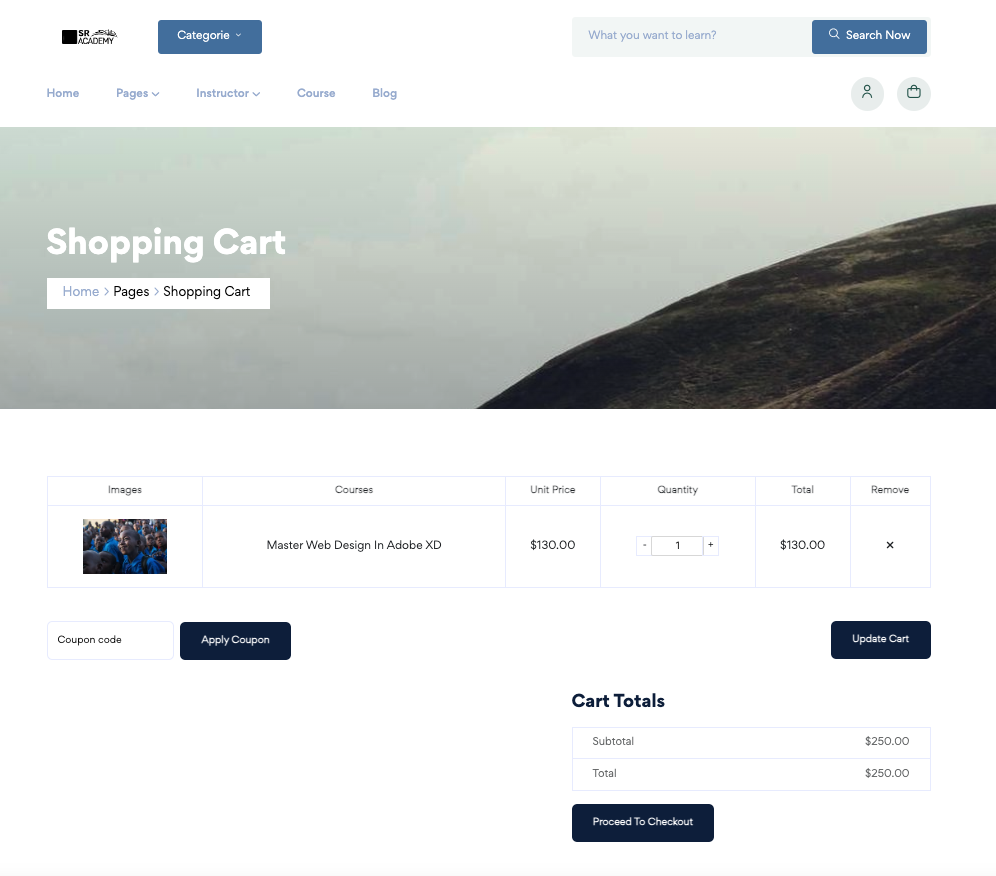
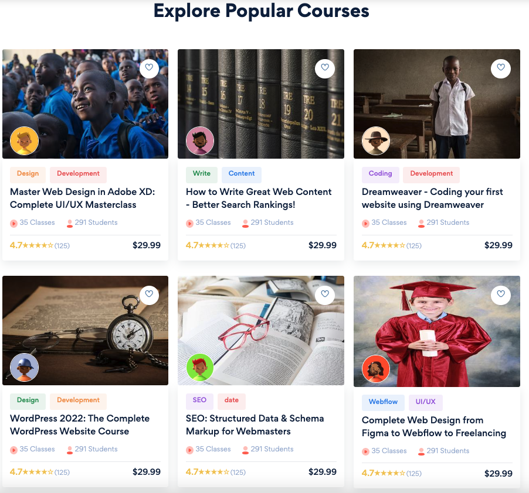

# 🎓 SR Academy - Online Courses & Education  

**SR Academy** is a modern, feature-rich Learning Management System (LMS) website designed to revolutionize online education. With a sleek user interface, interactive features, and robust functionality, SR Academy provides an intuitive platform for students, instructors, and administrators to engage in seamless learning and teaching experiences.  

---

## 🌟 Vision  

The goal of **SR Academy** is to make quality education accessible to everyone. Whether you're a learner seeking to acquire new skills or an instructor looking to share knowledge, SR Academy empowers you with a comprehensive platform to achieve your goals.  

---

## 📋 Key Features  

### 📚 **Courses**  
- Browse, search, and enroll in a wide range of online courses.  
- Categorized courses for easy navigation.  
- Course details include instructor profiles, pricing, and reviews.  

### ✍️ **Blogs**  
- Explore educational blogs written by experts in various fields.  
- Stay updated with the latest industry trends and insights.  

### 👩‍🏫 **Instructor Pages**  
- View detailed profiles of instructors, including their qualifications and expertise.  
- Direct access to their courses and blogs.  

### 🗂️ **Categories**  
- Discover courses through well-organized categories.  
- Filter options for better course exploration.  

### 🛡️ **Authentication**  
- Secure user registration and login with session handling.  
- Role-based access for students, instructors, and admins.  

### 🛒 **Checkout**  
- Easy and secure payment gateway integration.  
- Enroll in paid courses with a seamless checkout process.  

### 📞 **Contact Page**  
- Reach out to the team for support, inquiries, or feedback.  
- Integrated contact form for quick communication.  

---

## 🖼️ Screenshots  

| Screenshot 1               | Screenshot 2               | Screenshot 3               |
|----------------------------|----------------------------|----------------------------|
|  |  |  |

| Screenshot 4               | Screenshot 5               | Screenshot 6               |
|----------------------------|----------------------------|----------------------------|
|  |  |  |

| Screenshot 7               | Screenshot 8               | Screenshot 9               |
|----------------------------|----------------------------|----------------------------|
|  |  |  |  

---

## 🛠️ Technology Stack  

### **Frontend**  
- **React.js**: Core framework for building a dynamic and responsive UI.  
- **Redux**: State management for seamless user interaction.  
- **React Router**: Enabling smooth navigation across pages.  
- **Axios**: For efficient API integration and data fetching.  
- **Material-UI**: For consistent and modern design elements.  

### **Backend**  
- **Node.js**: For API development and server-side logic.  
- **Express.js**: Fast and lightweight framework for handling backend routes.  
- **MongoDB**: To store and manage user, course, and blog data.  

### **Additional Tools**  
- **JWT Authentication**: For secure login and session handling.  
- **Stripe API**: For secure and hassle-free payments.  

---

## 🚧 Challenges Overcome  

1. **User-Friendly Navigation**: Designed an intuitive UI for users to easily find courses and blogs.  
2. **Payment Integration**: Successfully implemented secure payment processing with Stripe API.  
3. **Scalable Design**: Built a platform capable of supporting a growing number of users and content.  

---

## 🏆 Accomplishments  

- Launched a robust platform for online education with integrated course and blog management.  
- Created a seamless user experience for students, instructors, and admins.  
- Implemented secure and reliable payment and authentication systems.  

---

## 🔮 Future Plans  

- **Interactive Features**: Add quizzes, live sessions, and discussion forums to enhance learning.  
- **AI Recommendations**: Suggest personalized courses and blogs based on user preferences.  
- **Mobile Optimization**: Develop a mobile-friendly version for on-the-go learning.  
- **Multi-Language Support**: Enable courses and blogs in multiple languages.  

---

## 🤝 Meet the Developer  

- **SR Joy**: Developer and visionary behind SR Academy. Dedicated to building impactful solutions for modern education.  

For collaboration, feedback, or to develop a platform like this, feel free to reach out:  
- **GitHub**: [srj101](https://github.com/srj101)  
- **Email**: [salimreza6835@gmail.com](mailto:salimreza6835@gmail.com)  
- **Phone**: +8801616346835  

---

## ❤️ A Message from the Developer  

Education is the foundation for growth and innovation. **SR Academy** is my contribution to making learning accessible and effective for everyone. Your support, suggestions, and ideas are invaluable as I continue to improve this platform. Let’s shape the future of education together!  

> _“An investment in knowledge pays the best interest.”_ — Benjamin Franklin  
